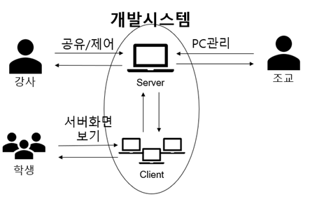

# Capstone Design - 실습실 강의 지원 프로그램
https://github.com/HYLogs/CapstoneDesign/assets/81233061/8281a508-108d-434c-80f4-7b6f72dc404f   

## 소개    
교내에서 2023-11에 열리는 Capstone Design 공모전에서 개발하는 "실습실 강의 지원" 서비스입니다.   
기능은 크게 세가지로 분류됩니다.   
- `화면 공유`: 실습실에서 학생은 본인의 자리가 너무 먼 경우 강의자료가 보이지 않는 문제가 있어서 화면 공유를 통해 각자 PC에서 강사의 강의 자료를 볼 수 있도록 해결.
- `원격 제어`: 실습실에서 강사는 학생들이 질문했을 경우 학생 자리를 찾아가며 학생 화면을 보고 질문에 답하기 어려운 문제가 있어서 강사의 PC에서 원격 제어를 통해 강사가 학생의 질문에 효과적으로 답을 줄 수 있도록 해결.
- `실습실 PC관리 장부`: 강사 PC에서 강의실의 PC마다 메모하는 기능을 넣어 PC마다 문제점, 특이점 등을 작성할 수 있도록 편의성 제공.   

## 팀원
- 박찬규: Server, front end, 실습실 PC관리 장부
- 유현승: 원격 제어
- 이한영: Client, front end, BroadCast 통신, 화면 공유

## 환경
- Python : 3.10.13
- PyQt5 : 5.15.9

## 개요도   
